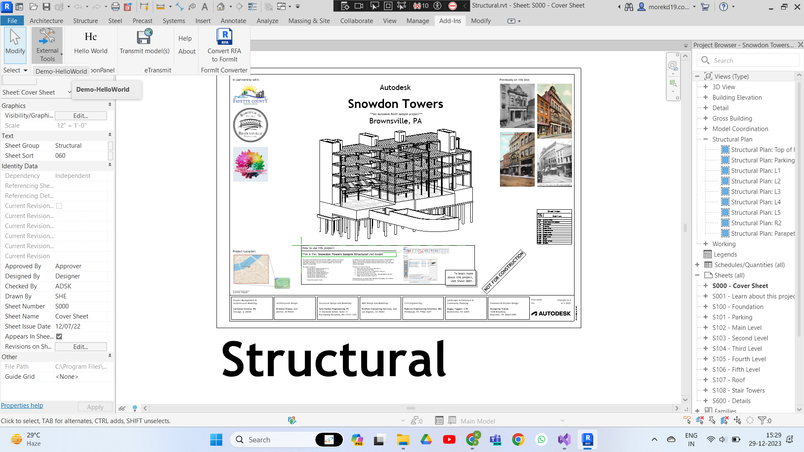
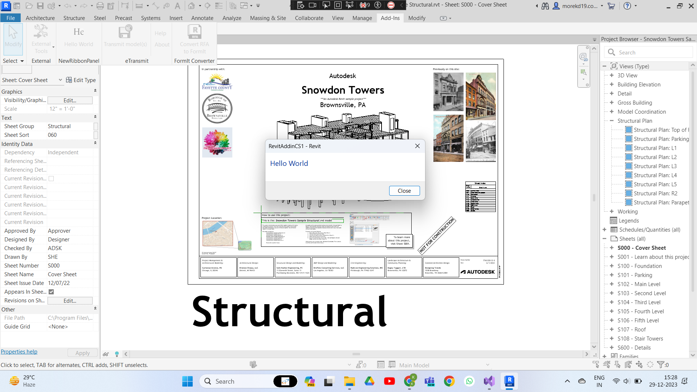

# Revit API Project

This repository contains two projects, AddButton and AddPanel, implementing a Revit API project. The AddButton project adds a "Hello World" button as a Revit add-in, while the AddPanel project creates a custom ribbon panel named "Hello World."

## Table of Contents
- [Getting Started](#getting-started)
- [AddButton Project](#AddButton-project)
- [AddPanel Project](#addpanel-project)
- [Screenshots](#screenshots)

## Getting Started

1. Clone the repository:

    ```bash
    [git clone https://github.com/kunalMore23/RevitAPI.git]
    ```

2. Open the solution file of the required project in Visual Studio.

3. Build the solution.

4. Run the Revit application and verify that the "Hello World" button and ribbon are visible.

## AddButton Project

The AddButton project adds a simple "Hello World" button as a Revit add-in. When clicked, it displays a message.

To use the AddButton add-in:
1. Load the add-in into Revit.
2. Navigate to the "Add-Ins" tab -> External-Tools -> Demo-Hello World
3. Click on the "Hello World" button.

## AddPanel Project

The AddPanel project creates a custom ribbon named "Hello World" and adds a button to it.

To use the AddPanel ribbon:
1. Load the add-in into Revit.
2. Navigate to the "HAdd-Ins" tab on the ribbon.
3. In that you will see "NewRibbonPanel" click on the Hello World image.

## Screenshots





